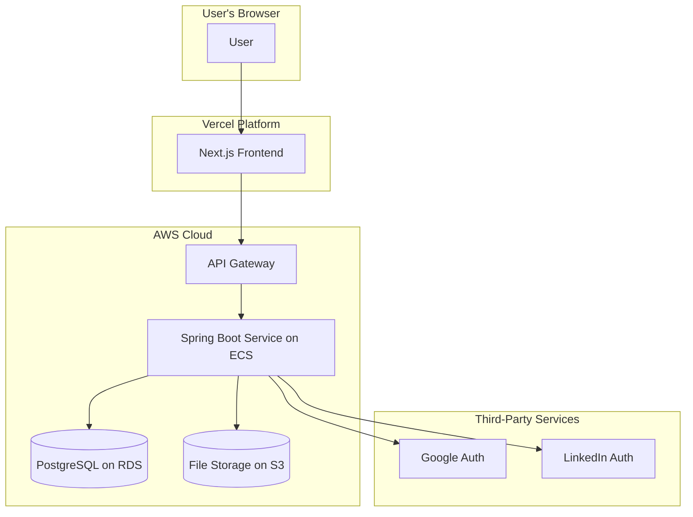
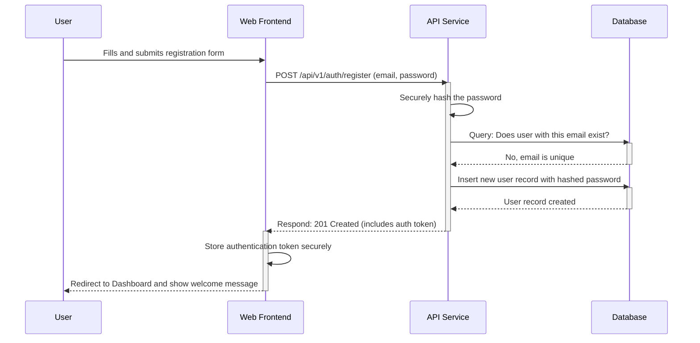
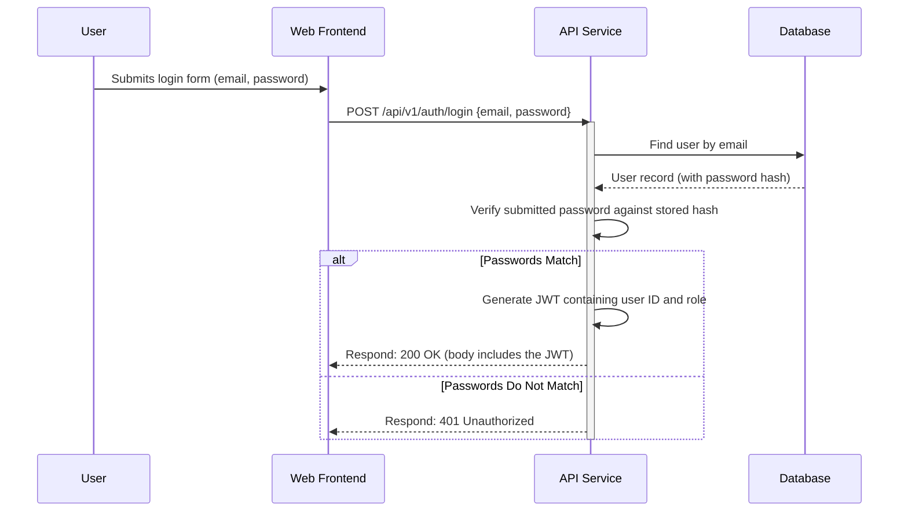
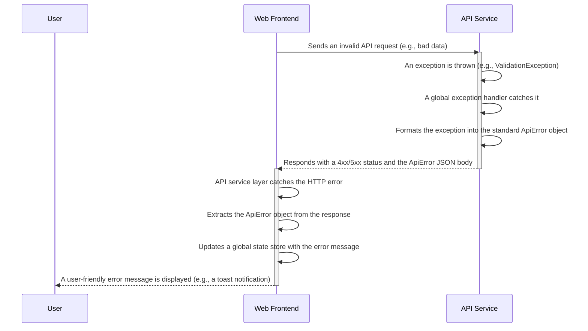

# Recruitify Fullstack Architecture Document

## 1. Introduction

This document outlines the complete fullstack architecture for Recruitify, including backend systems, frontend implementation, and their integration. It serves as the single source of truth for AI-driven development, ensuring consistency across the entire technology stack.

This unified approach combines what would traditionally be separate backend and frontend architecture documents, streamlining the development process for modern fullstack applications where these concerns are increasingly intertwined.

> **Starter Template or Existing Project**
> 
> This is a greenfield project. While we are not using a pre-packaged starter template (like T3 Stack or a MERN starter), the PRD has already specified the core technologies: a **Next.js** frontend and a **Spring Boot** backend, organized in a monorepo. Our architecture will be built from the ground up based on these foundational choices.

---

## 2. High Level Architecture

### Technical Summary

The proposed architecture for Recruitify is a modern, decoupled full-stack application. The frontend will be a **Next.js** application deployed on **Vercel**, leveraging its edge network for optimal performance and a Jamstack-style approach. The backend will be a **Spring Boot monolith**, containerized and running on **AWS**, which provides a robust and scalable environment. The two will communicate via a REST API, with an API Gateway acting as the single entry point for security and management. This architecture directly supports the PRD's goals of creating a fast, reliable, and secure platform that can be developed efficiently.

### Platform and Infrastructure Choice

*   **Platform:** A hybrid approach using **Vercel** for the frontend and **Amazon Web Services (AWS)** for the backend.
*   **Key Services:**
    *   **Vercel:** Next.js Hosting, Edge CDN, CI/CD for frontend.
    *   **AWS:**
        *   Amazon ECS (or Fargate) for running the containerized Spring Boot application.
        *   Amazon RDS for a managed PostgreSQL database.
        *   Amazon S3 for user file storage (e.g., profile pictures, resumes).
        *   Amazon API Gateway for managing the REST API.
*   **Deployment Host and Regions:** Vercel (Global Edge Network), AWS (e.g., us-east-1).

### Repository Structure

*   **Structure:** **Monorepo**, as specified in the PRD, to streamline development and code sharing.
*   **Monorepo Tool:** **Turborepo**. It offers high-speed builds, intelligent caching, and integrates seamlessly with Vercel.
*   **Package Organization:**
    *   `apps/web`: The Next.js frontend application.
    *   `apps/api`: The Spring Boot backend application.
    *   `packages/shared-types`: For sharing TypeScript types (e.g., API request/response models) between frontend and backend.

### High Level Architecture Diagram



### Architectural Patterns

*   **Jamstack (Frontend):** The frontend will be pre-rendered where possible and served from a global CDN, with dynamic features powered by APIs.
    *   *Rationale:* This provides maximum performance, scalability, and security for the user-facing application.
*   **Monolithic Service (Backend):** The backend will be a single, cohesive Spring Boot application.
    *   *Rationale:* For an MVP, a monolith is simpler to develop, deploy, and maintain than a microservices architecture.
*   **API Gateway:** All API requests from the frontend will pass through a central API Gateway.
    *   *Rationale:* This provides a single point for handling authentication, rate limiting, and routing, simplifying the backend service.
*   **Repository Pattern (Backend):** Data access logic will be abstracted into a repository layer.
    *   *Rationale:* This decouples the business logic from the database, making the code easier to test and maintain.

---

## 3. Tech Stack

### Technology Stack Table

| Category | Technology | Version | Purpose | Rationale |
| :--- | :--- | :--- | :--- | :--- |
| **Frontend** | | | | |
| Frontend Language | TypeScript | 5.x | Type safety, scalability | Industry standard for modern web apps. |
| Frontend Framework | Next.js | 14.x | Full-stack React framework | Chosen in PRD; excellent performance and DX. |
| UI Component Library | Ant Design | 5.x | UI consistency, rapid development | Chosen in UI/UX Spec for its rich components. |
| State Management | Zustand | 4.x | Simple, lightweight global state | Avoids boilerplate of Redux; ideal for most apps. |
| **Backend** | | | | |
| Backend Language | Java | 17 (LTS) | Robust, performant, mature | A stable, long-term support version. |
| Backend Framework | Spring Boot | 3.x | Rapid backend development | Chosen in PRD; vast ecosystem. |
| API Style | REST | | Standard for web APIs | Simple, well-understood, and stateless. |
| **Data & Storage**| | | | |
| Database | PostgreSQL | 15.x | Relational data storage | Powerful, open-source, and reliable. |
| File Storage | Amazon S3 | | User uploads (avatars, resumes) | Scalable, durable, and cost-effective. |
| **Auth** | | | | |
| Authentication | NextAuth.js & Spring Security | | User login, session management | NextAuth for easy social logins; Spring Security for API. |
| **Testing** | | | | |
| Frontend Testing | Jest & React Testing Library | latest | Unit & component testing | Standard for React/Next.js applications. |
| Backend Testing | JUnit 5 & Mockito | latest | Unit & integration testing | Standard for the Java/Spring ecosystem. |
| E2E Testing | Playwright | latest | End-to-end browser testing | Modern, fast, and reliable cross-browser testing. |
| **DevOps** | | | | |
| CI/CD | Vercel & GitHub Actions | | Automated build, test, deploy | Vercel for FE, GitHub Actions for BE container. |
| IaC Tool | AWS CDK | latest | Infrastructure as Code | Define AWS infrastructure using TypeScript. |
| Monitoring | Vercel Analytics & AWS CloudWatch | | Performance and health monitoring | Native monitoring for our chosen platforms. |

---

## 4. Data Models

### Model: User

**Purpose:** Represents an authenticated user in the system, holding core identity and security information. A `role` attribute will distinguish between Job Seekers and Recruiters.

**Key Attributes:**

*   `id`: `string` (UUID) - The unique primary key.
*   `email`: `string` - The user's unique email address for login.
*   `passwordHash`: `string` - The securely hashed password (never exposed via API).
*   `role`: `'JOB_SEEKER' | 'RECRUITER'` - The user's role in the system.
*   `createdAt`: `Date` - Timestamp of account creation.
*   `updatedAt`: `Date` - Timestamp of the last update.

**TypeScript Interface:**

```typescript
export interface User {
  id: string;
  email: string;
  role: 'JOB_SEEKER' | 'RECRUITER';
  createdAt: Date;
  updatedAt: Date;
}
```

**Relationships:**

*   A `User` with the `JOB_SEEKER` role has one `UserProfile`.
*   A `User` with the `RECRUITER` role has many `JobPostings`.

---


### Model: UserProfile

**Purpose:** Stores the detailed professional information for a `JOB_SEEKER`, separate from their core authentication data.

**Key Attributes:**

*   `userId`: `string` - A foreign key linking directly to the `User` model's `id`.
*   `firstName`: `string` - The user's first name.
*   `lastName`: `string` - The user's last name.
*   `headline`: `string` - A short, professional headline (e.g., "Senior Software Engineer").
*   `summary`: `string` - A longer "About Me" section.
*   `avatarUrl`: `string` - URL to the user's profile picture, stored in Amazon S3.

**TypeScript Interface:**

```typescript
import { User } from './user'; // Assuming types are co-located

export interface UserProfile extends User {
  firstName: string;
  lastName: string;
  headline: string;
  summary: string;
  avatarUrl: string;
  workExperiences: WorkExperience[];
  educations: Education[];
  skills: Skill[];
}
```

**Relationships:**

*   Belongs to one `User`.
*   Has many `WorkExperience` entries.
*   Has many `Education` entries.
*   Has many `Skills`.

---


### Model: WorkExperience

**Purpose:** Represents a single job or position within a user's professional history.

**Key Attributes:**

*   `id`: `string` (UUID) - The primary key.
*   `profileId`: `string` - Foreign key to the `UserProfile`.
*   `jobTitle`: `string`
*   `companyName`: `string`
*   `location`: `string` (e.g., "San Francisco, CA")
*   `startDate`: `Date`
*   `endDate`: `Date` (Can be null if it's the current job).
*   `description`: `string` - A summary of responsibilities and achievements.

**TypeScript Interface:**

```typescript
export interface WorkExperience {
  id: string;
  jobTitle: string;
  companyName: string;
  location: string;
  startDate: Date;
  endDate: Date | null;
  description: string;
}
```

**Relationships:**

*   Belongs to one `UserProfile`.

---


### Model: Education

**Purpose:** Represents a single entry in a user's education history.

**Key Attributes:**

*   `id`: `string` (UUID) - The primary key.
*   `profileId`: `string` - Foreign key to the `UserProfile`.
*   `schoolName`: `string`
*   `degree`: `string` (e.g., "Bachelor of Science")
*   `fieldOfStudy`: `string` (e.g., "Computer Science")
*   `startDate`: `Date`
*   `endDate`: `Date`
*   `description`: `string` - Notes on activities, awards, etc.

**TypeScript Interface:**

```typescript
export interface Education {
  id: string;
  schoolName: string;
  degree: string;
  fieldOfStudy: string;
  startDate: Date;
  endDate: Date;
  description: string;
}
```

**Relationships:**

*   Belongs to one `UserProfile`.

---


### Model: Skill

**Purpose:** Represents a distinct professional skill that can be associated with multiple users.

**Key Attributes:**

*   `id`: `string` (UUID) - The primary key.
*   `name`: `string` (e.g., "TypeScript", "Project Management") - Must be unique.

**TypeScript Interface:**

```typescript
export interface Skill {
  id: string;
  name: string;
}
```

**Relationships:**

*   Has a many-to-many relationship with `UserProfile`. A join table (`UserProfileSkills`) will be used to link users to their skills.

---

## 5. API Specification

### REST API Specification (OpenAPI 3.0)

```yaml
openapi: 3.0.0
info:
  title: Recruitify API
  version: 1.0.0
  description: The official API for the Recruitify platform.
servers:
  - url: /api/v1
    description: Version 1 of the Recruitify API

paths:
  /profile:
    get:
      summary: Get the current authenticated user's full profile
      tags: [Profile]
      responses:
        '200':
          description: The user's complete profile.
          content:
            application/json:
              schema:
                $ref: '#/components/schemas/UserProfile'
        '401':
          description: Unauthorized.

  /profile/work-experience:
    post:
      summary: Add a new work experience to the user's profile
      tags: [Profile]
      requestBody:
        required: true
        content:
          application/json:
            schema:
              $ref: '#/components/schemas/WorkExperienceInput'
      responses:
        '201':
          description: The work experience was created successfully.
          content:
            application/json:
              schema:
                $ref: '#/components/schemas/WorkExperience'

  /profile/work-experience/{experienceId}:
    put:
      summary: Update an existing work experience
      tags: [Profile]
      parameters:
        - name: experienceId
          in: path
          required: true
          schema:
            type: string
            format: uuid
      requestBody:
        required: true
        content:
          application/json:
            schema:
              $ref: '#/components/schemas/WorkExperienceInput'
      responses:
        '200':
          description: The updated work experience object.
          content:
            application/json:
              schema:
                $ref: '#/components/schemas/WorkExperience'

components:
  schemas:
    WorkExperience:
      type: object
      properties:
        id: { type: string, format: uuid }
        jobTitle: { type: string }
        companyName: { type: string }
        # ... other fields from the WorkExperience model

    WorkExperienceInput:
      type: object
      properties:
        jobTitle: { type: string }
        companyName: { type: string }
        # ... other fields, but excluding 'id'

    UserProfile:
      type: object
      properties:
        id: { type: string, format: uuid }
        email: { type: string, format: email }
        # ... all other fields from the UserProfile model
```

---

## 6. Components

### Component: Web Frontend

**Responsibility:** This component is responsible for rendering the entire user interface and handling all user interactions in the browser. It fetches data from the backend API, manages client-side state, and presents a responsive, accessible, and performant experience to the user.

**Key Interfaces:**

*   **Pages/Routes:** Serves all user-facing pages, including `/` (Homepage), `/dashboard`, `/profile`, and job search pages.
*   **API Client:** Contains the logic for making authenticated requests to the backend API Service.

**Dependencies:**

*   **API Service:** Relies on the backend API for all data fetching and mutations.
*   **Authentication Service:** Depends on the backend for user authentication and session validation.
*   **External Auth Providers:** Interacts with Google/LinkedIn for social sign-on.

**Technology Stack:** Next.js, React, TypeScript, Ant Design, Zustand, NextAuth.js.

---


### Component: API Service

**Responsibility:** This component is the central backend monolith. It is responsible for implementing all business logic, processing data, and managing the application's state. It handles requests from the Web Frontend, enforces business rules, interacts with the database, and integrates with any external services.

**Key Interfaces:**

*   **REST API:** Exposes the secure REST API (defined in our OpenAPI specification) that the Web Frontend consumes. This is its sole interface with the outside world, accessed via the API Gateway.

**Dependencies:**

*   **Database Service (PostgreSQL):** For all data persistence and retrieval.
*   **File Storage Service (S3):** For storing and retrieving large binary files like resumes or profile pictures.
*   **External Auth Providers (Google/LinkedIn):** For validating social login tokens during the authentication process.

**Technology Stack:** Spring Boot, Java 17, Gradle, JUnit 5, Mockito.

---

## 7. External APIs

### API: Google Sign-In

*   **Purpose:** To allow users to register and log in to Recruitify using their existing Google account, providing a fast and secure authentication option.
*   **Documentation:** [https://developers.google.com/identity/sign-in/web/sign-in](https://developers.google.com/identity/sign-in/web/sign-in)
*   **Authentication:** OAuth 2.0. The frontend will handle the initial OAuth flow, receiving an ID Token from Google.
*   **Rate Limits:** N/A (Standard Google API usage policies apply).

**Key Endpoints Used:**

*   `POST https://oauth2.googleapis.com/tokeninfo?id_token={token}` - This endpoint will be called by our **API Service** to verify the integrity and authenticity of the ID Token received from the frontend.

**Integration Notes:**

*   A Google Cloud Platform project must be created and configured with the correct OAuth consent screen details.
*   A Client ID and Client Secret must be securely stored in our backend's environment variables.
*   The frontend will be responsible for managing the pop-up/redirect flow to get the user's consent and retrieve the token.

---


### API: LinkedIn Login

*   **Purpose:** To allow users to register and log in using their existing LinkedIn account, which is highly relevant for a professional recruiting platform.
*   **Documentation:** [https://learn.microsoft.com/en-us/linkedin/consumer/integrations/self-serve/sign-in-with-linkedin-v2](https://learn.microsoft.com/en-us/linkedin/consumer/integrations/self-serve/sign-in-with-linkedin-v2)
*   **Authentication:** OAuth 2.0. The flow is similar to Google's, where the frontend initiates the process and the backend verifies the user and retrieves their profile data.
*   **Rate Limits:** Standard LinkedIn API usage policies apply.

**Key Endpoints Used:**

*   `POST https://www.linkedin.com/oauth/v2/accessToken` - Our **API Service** will exchange an authorization code (provided by the frontend) for an access token.
*   `GET https://api.linkedin.com/v2/me` - Our **API Service** will use the access token to fetch basic profile information (like name and email) to create the user account.

**Integration Notes:**

*   A LinkedIn Developer Application must be created to obtain a Client ID and Client Secret.
*   The necessary permissions (scopes) like `r_liteprofile` and `r_emailaddress` must be requested.
*   Our backend will be responsible for securely handling the token exchange and fetching user data.

---

## 8. Core Workflows

### Workflow: New User Registration

This diagram shows the sequence of events when a new user signs up for Recruitify using their email and password.



---

## 9. Database Schema

### PostgreSQL Database Schema

```sql
-- Users table for authentication and role management
CREATE TABLE users (
    id UUID PRIMARY KEY DEFAULT gen_random_uuid(),
    email VARCHAR(255) UNIQUE NOT NULL,
    password_hash VARCHAR(255) NOT NULL,
    role VARCHAR(50) NOT NULL CHECK (role IN ('JOB_SEEKER', 'RECRUITER')),
    created_at TIMESTAMPTZ NOT NULL DEFAULT NOW(),
    updated_at TIMESTAMPTZ NOT NULL DEFAULT NOW()
);

-- Profiles for JOB_SEEKER users
CREATE TABLE user_profiles (
    user_id UUID PRIMARY KEY REFERENCES users(id) ON DELETE CASCADE,
    first_name VARCHAR(255),
    last_name VARCHAR(255),
    headline TEXT,
    summary TEXT,
    avatar_url VARCHAR(255)
);

-- Work experiences linked to a user profile
CREATE TABLE work_experiences (
    id UUID PRIMARY KEY DEFAULT gen_random_uuid(),
    user_profile_id UUID NOT NULL REFERENCES user_profiles(user_id) ON DELETE CASCADE,
    job_title VARCHAR(255) NOT NULL,
    company_name VARCHAR(255) NOT NULL,
    location VARCHAR(255),
    start_date DATE NOT NULL,
    end_date DATE, -- Can be NULL for current job
    description TEXT
);

-- Education history linked to a user profile
CREATE TABLE education (
    id UUID PRIMARY KEY DEFAULT gen_random_uuid(),
    user_profile_id UUID NOT NULL REFERENCES user_profiles(user_id) ON DELETE CASCADE,
    school_name VARCHAR(255) NOT NULL,
    degree VARCHAR(255),
    field_of_study VARCHAR(255),
    start_date DATE NOT NULL,
    end_date DATE
);

-- Centralized skills table to prevent duplicates
CREATE TABLE skills (
    id UUID PRIMARY KEY DEFAULT gen_random_uuid(),
    name VARCHAR(100) UNIQUE NOT NULL
);

-- Join table to create a many-to-many relationship between profiles and skills
CREATE TABLE user_profile_skills (
    user_profile_id UUID NOT NULL REFERENCES user_profiles(user_id) ON DELETE CASCADE,
    skill_id UUID NOT NULL REFERENCES skills(id) ON DELETE CASCADE,
    PRIMARY KEY (user_profile_id, skill_id)
);

-- Create indexes on foreign keys for faster queries
CREATE INDEX ON work_experiences (user_profile_id);
CREATE INDEX ON education (user_profile_id);
CREATE INDEX ON user_profile_skills (user_profile_id);
CREATE INDEX ON user_profile_skills (skill_id);
```

---

## 10. Frontend Architecture

### Component Architecture

#### Component Organization

We will adopt a hybrid approach, separating generic, reusable UI components from larger, feature-specific components. This provides a clean, scalable, and maintainable structure.

```
apps/web/src/
├── components/
│   ├── ui/          # Generic, reusable UI components (e.g., Button, Card, Input)
│   └── layout/      # App layout components (e.g., Navbar, Footer, PageWrapper)
│
├── features/
│   ├── auth/        # Components related to authentication (e.g., LoginForm)
│   ├── profile/     # Components specifically for the User Profile feature
│   │   ├── WorkExperienceCard.tsx
│   │   ├── WorkExperienceForm.tsx
│   │   └── SkillTagInput.tsx
│   └── jobs/        # Components for job search, posting, etc.
│
├── pages/           # Next.js page routes (e.g., /profile, /dashboard)
│
└── ... (other folders like hooks, services, etc.)
```

### State Management Architecture

We will use **Zustand** for global state management, chosen for its simplicity, minimal boilerplate, and performance. We will structure our state into modular, feature-based stores.

#### State Structure

Our state will be divided into separate "stores" or "slices," each responsible for a specific domain of the application. This keeps stores small, focused, and easy to manage.

```
apps/web/src/stores/
├── useUserStore.ts     # Manages authenticated user data and session info
├── useProfileStore.ts  # Manages state for the user profile page (e.g., editing state)
└── useJobsStore.ts       # Manages state for job searches, filters, and results
```

#### State Management Patterns

*   **Async Actions:** API calls that modify global state will be encapsulated as async actions within the relevant store. For example, `useProfileStore` will have an action like `fetchUserProfile(userId)` that handles the API call and updates the store with the result.
*   **Computed State:** We will use selectors to derive values from the base state wherever possible (e.g., deriving a `user.isLoggedIn` boolean from the presence of a user object).
*   **Persistence:** We will use Zustand's `persist` middleware to save critical, non-sensitive state to `localStorage`, such as the user's session information, to keep them logged in across browser sessions.

### Routing Architecture

We will use the file-system based router built into Next.js. The structure of the `pages` directory will define the application's URL structure.

#### Route Organization

The `pages` directory will be organized logically, with dynamic routes used for specific resources like jobs.

```
apps/web/src/pages/
├── _app.tsx          # Global App component, wraps all pages
├── index.tsx         # Homepage route: /
├── login.tsx         # Login & Registration route: /login
│
├── dashboard.tsx     # Protected route: /dashboard
├── profile.tsx       # Protected route: /profile
│
└── jobs/
    ├── index.tsx     # Job search results route: /jobs
    └── [jobId].tsx   # Dynamic route for a single job: /jobs/some-job-id
```

#### Protected Route Pattern

To protect routes that require authentication (like `/dashboard` and `/profile`), we will create a wrapper component, for example, `<AuthGuard>`.

This component will wrap the page's content. It will check for the user's authentication status (e.g., by checking our `useUserStore`).

*   If the user **is authenticated**, it will render the page's content.
*   If the user **is not authenticated**, it will redirect them to the `/login` page.

This check will happen on the client-side. We can also add server-side checks in `getServerSideProps` for pages that require it, providing an additional layer of security.

### Frontend Services Layer

To keep our UI components clean and decoupled from the backend, we will create a dedicated "services layer." This layer will be responsible for all API communication. Components will never make direct HTTP requests; they will always go through this layer.

#### API Client Setup

We will create a single, centralized `axios` instance that will be used for all API requests. This instance will be configured with the API base URL and an interceptor to automatically attach the user's authentication token to every request.

```typescript
// located at services/apiClient.ts
import axios from 'axios';
import { useUserStore } from '@/stores/useUserStore';

const apiClient = axios.create({
  baseURL: process.env.NEXT_PUBLIC_API_URL || '/api/v1',
});

// Request interceptor to add the auth token
apiClient.interceptors.request.use((config) => {
  const token = useUserStore.getState().token;
  if (token) {
    config.headers.Authorization = `Bearer ${token}`;
  }
  return config;
});

export default apiClient;
```

#### Service Example

For each feature or data model, we will create a corresponding service file that uses the `apiClient` to export a set of functions.

```typescript
// located at services/profileService.ts
import apiClient from './apiClient';
import { UserProfile, WorkExperience } from '@/packages/shared-types';

export const profileService = {
  getProfile: async (): Promise<UserProfile> => {
    const response = await apiClient.get('/profile');
    return response.data;
  },

  addWorkExperience: async (data: Partial<WorkExperience>): Promise<WorkExperience> => {
    const response = await apiClient.post('/profile/work-experience', data);
    return response.data;
  },
};
```

---

## 11. Backend Architecture

### Service Architecture

As we've chosen a traditional server model with Spring Boot, our architecture will be based on the standard Controller-Service-Repository pattern.

#### Controller/Route Organization

We will organize our REST controllers by feature or domain, which mirrors the structure of our frontend and API specification. This keeps related endpoints grouped together and makes the codebase easy to navigate.

```java
// In package com.recruitify.
└── controller/
    ├── AuthController.java       # Handles POST /api/v1/auth/register, /login
    ├── ProfileController.java    # Handles GET /api/v1/profile, POST/PUT /profile/work-experience
    ├── JobController.java        # Handles all endpoints under /api/v1/jobs
    └── ... (other controllers as features are added)
```

Each controller will be responsible for handling HTTP requests for a specific resource, validating the input, and delegating the business logic to a corresponding `Service` class.

### Database Architecture

#### Schema Design

The database schema will be based on the SQL script we defined previously in the "Database Schema" section. That script is the single source of truth for our table structures, relationships, and constraints.

#### Data Access Layer (DAL)

We will use the **Repository Pattern** to abstract all database interactions. This pattern will be implemented using **Spring Data JPA**.

For each of our data models (e.g., `User`, `UserProfile`), we will create a corresponding repository interface that extends Spring's `JpaRepository`. Spring Data JPA will then automatically provide a complete implementation for all standard CRUD (Create, Read, Update, Delete) operations at runtime. This drastically reduces the amount of boilerplate code we need to write.

Custom queries can be easily added by defining new method signatures in the interface.

**Repository Example:**

```java
// In package com.recruitify.repository
import org.springframework.data.jpa.repository.JpaRepository;
import java.util.Optional;
import java.util.UUID;

// The User entity and its primary key type (UUID) are specified
public interface UserRepository extends JpaRepository<User, UUID> {

    // Spring Data JPA will automatically implement this method
    // to find a user by their email address.
    Optional<User> findByEmail(String email);
}
```

### Authentication and Authorization

We will use **Spring Security** to secure our backend API. Since our API is stateless (a key principle of REST), we will use **JSON Web Tokens (JWT)** for authentication.

#### Authentication Flow (Login)

This diagram illustrates how a user logs in and receives a JWT.



#### Authorization Filter (Middleware)

To protect our endpoints (e.g., `GET /profile`), we will implement a custom `JwtAuthorizationFilter` within the Spring Security filter chain.

1.  For every incoming request to a protected endpoint, this filter will execute.
2.  It will look for an `Authorization` header with a `Bearer <token>` value.
3.  It will validate the JWT's signature, claims, and expiration date.
4.  If the token is valid, the filter will extract the user's identity, set up the Spring Security context, and allow the request to proceed to the controller.
5.  If the token is missing, invalid, or expired, the filter will immediately reject the request with a `401 Unauthorized` status.

---

## 12. Unified Project Structure

### Project Directory Structure

```
recruitify-client/
├── .github/
│   └── workflows/
│       └── ci.yaml             # CI/CD for frontend
│
├── src/
│   ├── components/             # UI components
│   ├── features/               # Feature modules (profile, jobs)
│   ├── pages/                  # Next.js routes
│   ├── services/               # API service layer
│   └── stores/                 # Zustand state stores
│
├── package.json
├── next.config.js
├── tsconfig.json
└── README.md

recruitify-server/
├── .github/
│   └── workflows/
│       └── ci.yaml             # CI/CD for backend
│
├── src/main/java/com/recruitify/
│   ├── controller/             # REST Controllers
│   ├── service/                # Business logic
│   ├── repository/             # JPA repositories
│   └── entities/               # Entity models
│
├── src/main/resources/
│   └── application.yml         # Config (DB, server port, etc.)
│
├── build.gradle
├── settings.gradle
└── README.md
```

---

## 13. Development Workflow

### Local Development Setup

#### Prerequisites

A developer will need the following tools installed on their machine:
*   Node.js (v18 or later)
*   npm (v9 or later)
*   Java (JDK 17)
*   Gradle
*   Docker & Docker Compose

#### Initial Setup

After cloning the repository, the initial setup is straightforward:

```bash
# 1. Install all Node.js dependencies from the root
npm install

# 2. Start the PostgreSQL database using Docker
docker-compose up -d
```

#### Development Commands

We will define scripts in the root `package.json` to manage the development servers using Turborepo.

```bash
# Start both the frontend and backend concurrently
# This will be the primary command used for development.
npm run dev

# Start only the Next.js frontend application
npm run dev:web

# Start only the Spring Boot backend application
npm run dev:api

# Run all tests across the monorepo
npm run test
```

### Environment Configuration

We will use `.env` files to manage environment variables for local development. A template file named `.env.example` will be committed to the repository to serve as a guide.

#### Required Environment Variables (`.env.example`)

```bash
# =================================================
# Frontend Variables (copy to apps/web/.env.local)
# =================================================

# The full URL of the backend API service
NEXT_PUBLIC_API_URL=http://localhost:8080/api/v1

# --- NextAuth.js Configuration ---
# A long, randomly generated string for session encryption
NEXTAUTH_SECRET=
NEXTAUTH_URL=http://localhost:3000

# --- Social Logins ---
GOOGLE_CLIENT_ID=
GOOGLE_CLIENT_SECRET=
LINKEDIN_CLIENT_ID=
LINKEDIN_CLIENT_SECRET=


# =================================================
# Backend Variables (copy to apps/api/.env)
# =================================================

# --- Database Connection ---
DB_URL=jdbc:postgresql://localhost:5432/recruitify
DB_USERNAME=postgres
DB_PASSWORD=postgres

# --- JWT Configuration ---
# A long, randomly generated string for signing tokens
JWT_SECRET=
JWT_EXPIRATION_MS=86400000 # 24 hours

# --- AWS S3 Configuration for File Storage ---
AWS_ACCESS_KEY_ID=
AWS_SECRET_ACCESS_KEY=
AWS_REGION=
S3_BUCKET_NAME=
```

---

## 14. Deployment Architecture

### Deployment Strategy

We will adopt a separate deployment strategy for the frontend and backend, leveraging the strengths of each hosting platform.

#### Frontend Deployment

*   **Platform:** **Vercel**
*   **Process:**
    1.  The GitHub repository will be connected to a Vercel project.
    2.  Every push to the `main` branch will automatically trigger a production deployment.
    3.  Every pull request will automatically receive its own unique "preview" deployment URL for testing and review before merging.
    4.  Vercel will handle the build process, deploy the static assets to its global Edge CDN, and manage the serverless functions for Next.js.

#### Backend Deployment

*   **Platform:** **AWS (via GitHub Actions)**
*   **Process:**
    1.  A CI/CD workflow will be defined in `.github/workflows/ci.yaml`.
    2.  On a push to the `main` branch, the GitHub Actions workflow will be triggered.
    3.  The workflow will:
        a. Build the Spring Boot application into a runnable JAR.
        b. Build a Docker image from a `Dockerfile` that contains the JAR.
        c. Push the new Docker image to **Amazon Elastic Container Registry (ECR)**.
        d. Trigger a service update in **Amazon Elastic Container Service (ECS)** to deploy the new container image using the **Fargate** launch type.

### CI/CD Pipeline (Backend)

The backend deployment will be managed by a GitHub Actions workflow. The following is a conceptual outline of the pipeline configuration.

```yaml
# .github/workflows/ci.yaml
name: Deploy API to Production

on:
  push:
    branches: [ "main" ] # Trigger on push to the main branch

jobs:
  deploy:
    runs-on: ubuntu-latest
    steps:
      - name: Checkout Repository
        uses: actions/checkout@v3

      - name: Configure AWS Credentials
        uses: aws-actions/configure-aws-credentials@v2
        with:
          aws-access-key-id: ${{ secrets.AWS_ACCESS_KEY_ID }}
          aws-secret-access-key: ${{ secrets.AWS_SECRET_ACCESS_KEY }}
          aws-region: us-east-1

      - name: Build, tag, and push image to Amazon ECR
        # This step would use docker build, tag, and push commands
        # to get the new image into our container registry.

      - name: Deploy to Amazon ECS
        # This step would use the AWS CLI to update the ECS service
        # with the new container image definition, triggering a deployment.
```

### Environments

We will maintain three distinct environments to ensure a stable and reliable release process.

| Environment | Frontend URL | Backend URL | Purpose |
| :--- | :--- | :--- | :--- |
| **Development** | `http://localhost:3000` | `http://localhost:8080` | For developers to build and test on their local machines. |
| **Staging** | `staging.recruitify.app` | `api.staging.recruitify.app` | A mirror of production for final testing and QA before release. |
| **Production** | `www.recruitify.app` | `api.recruitify.app` | The live environment for end-users. |

---

## 15. Security and Performance

### Security Requirements

#### Frontend Security

*   **Content Security Policy (CSP):** A strict CSP will be implemented to mitigate Cross-Site Scripting (XSS) and other injection attacks by specifying which sources of content are allowed to be loaded.
*   **Secure Token Storage:** The JWT received from the backend will be stored in a secure, `HttpOnly` cookie. This prevents it from being accessed by client-side JavaScript, which is the primary vector for token theft via XSS.

#### Backend Security

*   **Input Validation:** All incoming API request bodies (DTOs) will be rigorously validated on the backend using `jakarta.validation` annotations (`@Valid`, `@NotNull`, `@Size`, etc.) to prevent invalid or malicious data from entering the system.
*   **Rate Limiting:** We will implement IP-based rate limiting on sensitive endpoints (like login and registration) to protect against brute-force and denial-of-service attacks.
*   **CORS Policy:** The Cross-Origin Resource Sharing (CORS) policy will be configured to only allow requests from our specific frontend domains (production, staging, and Vercel preview URLs).

#### Authentication Security

*   **Password Policy:** We will enforce a strong password policy (e.g., minimum length, complexity requirements) using Spring Security.
*   **Password Hashing:** All user passwords will be hashed using a strong, modern algorithm like BCrypt.

### Performance Optimization

#### Frontend Performance

*   **Loading Strategy:** We will heavily leverage Next.js's rendering capabilities:
    *   **Static Site Generation (SSG):** For any pages that can be pre-built (e.g., landing pages, about page).
    *   **Server-Side Rendering (SSR):** For pages that require fresh data on every request but need good SEO (e.g., a job details page).
    *   **Client-Side Rendering (CSR):** For private, user-specific pages like the dashboard and profile, where data is fetched after the initial page load.
*   **Code Splitting:** We will use Next.js's automatic code splitting and dynamic imports (`next/dynamic`) to ensure that users only download the JavaScript needed for the page they are viewing.
*   **Image Optimization:** We will use the built-in Next.js `<Image>` component to automatically optimize images, resize them for different devices, and serve them in modern formats like WebP.
*   **API Response Caching:** We will use a library like **SWR** or **React Query** to cache API responses on the client-side, preventing redundant network requests for the same data.

#### Backend Performance

*   **Response Time Target:** Our goal is a median API response time of **< 100ms** for standard read operations.
*   **Database Optimization:** We have already included indexes in our schema. We will also use connection pooling (provided by default in Spring Boot) and will analyze slow queries as needed.
*   **Application-Level Caching:** We will use **Redis** (defined in our tech stack) to cache frequently accessed and computationally expensive data. For example, a user's fully assembled profile could be cached for a few minutes to reduce database load.

---

## 16. Testing Strategy

### The Testing Pyramid

Our testing strategy is based on a pyramid shape, which emphasizes having a large foundation of fast, isolated tests and a smaller number of slower, more integrated tests.

```
     / \
    / E2E \
   /_______
  /         \
 / Integration \
/_______________
/  Unit Tests   \
```

*   **Unit Tests (The Foundation):** These will be the most numerous tests in our codebase. They are small, fast, and test a single piece of code (like a React component or a Java service method) in isolation.
    *   **Backend:** Using **JUnit 5** and **Mockito**.
    *   **Frontend:** Using **Jest** and **React Testing Library**.
*   **Integration Tests (The Middle):** These tests verify that multiple components work together correctly. They are slightly slower and more complex than unit tests.
    *   **Backend:** Testing the interaction between controllers, services, and repositories (e.g., a full API request/response cycle).
    *   **Frontend:** Testing a component that uses a custom hook or interacts with a state store.
*   **End-to-End (E2E) Tests (The Peak):** These are the least numerous but most comprehensive tests. They simulate a real user's journey through the application in an actual browser.
    *   **Tool:** Using **Playwright**.
    *   **Example Flow:** A script that automates signing up, logging in, editing a profile, and applying for a job.

### Test Organization

*   **Frontend Tests (`apps/web`):** Unit and integration test files will be co-located with the code they are testing. For example, a test for `WorkExperienceCard.tsx` will be named `WorkExperienceCard.test.tsx` and live in the same directory.
*   **Backend Tests (`apps/api`):** Following standard Gradle convention, all tests will reside in the `src/test/java` directory, mirroring the package structure of the main source code.
*   **E2E Tests:** End-to-end tests written with Playwright will live in a separate, top-level `e2e/` directory at the root of the monorepo.

### Test Examples

#### Frontend Component Test Example (Jest & RTL)

This test verifies that a React component renders the correct data.

```typescript
// In apps/web/src/features/profile/WorkExperienceCard.test.tsx

it('should render the job title and company name', () => {
  const mockExperience = { jobTitle: 'Software Engineer', companyName: 'Recruitify', ... };
  render(<WorkExperienceCard experience={mockExperience} />);

  // Assert that the component correctly displays the passed-in data
  expect(screen.getByText('Software Engineer')).toBeInTheDocument();
  expect(screen.getByText('Recruitify')).toBeInTheDocument();
});
```

#### Backend Unit Test Example (JUnit 5 & Mockito)

This test verifies that a service method correctly calls its dependencies, without needing a real database.

```java
// In apps/api/src/test/java/com/recruitify/service/UserServiceTest.java

@Test
void whenRegisteringUser_itShouldHashThePassword() {
  // Given (Setup)
  RegisterUserDto dto = new RegisterUserDto("test@test.com", "password");
  when(userRepository.findByEmail(anyString())).thenReturn(Optional.empty());

  // When (Action)
  userService.register(dto);

  // Then (Verification)
  // Verify that the password hashing method was called exactly once
  verify(passwordEncoder, times(1)).encode("password");
  // Verify that the save method was called on the repository
  verify(userRepository, times(1)).save(any(User.class));
}
```

---

## 17. Coding Standards

### Critical Fullstack Rules

1.  **Single Source of Truth for Types:** All types and interfaces shared between the frontend and backend (e.g., API responses) **MUST** be defined in the `packages/shared-types` directory. There should be no duplicate type definitions.
2.  **Use the Service Layer:** Frontend components **MUST NOT** make direct HTTP requests (e.g., using `axios` or `fetch`). They **MUST** call functions exported from the `services` layer (e.g., `profileService.getProfile()`).
3.  **Isolate Environment Variables:** Code **MUST NOT** access `process.env` directly. A dedicated configuration module should be created to parse, validate, and export environment variables to the rest of the application.
4.  **Immutable State:** Global state managed by Zustand **MUST NEVER** be mutated directly. Always use the `set` function within an action to produce a new state.

### Naming Conventions

| Element | Convention | Example |
| :--- | :--- | :--- |
| **Frontend** | | |
| React Components | `PascalCase` | `UserProfileCard.tsx` |
| React Hooks | `useCamelCase` | `useUserProfile.ts` |
| CSS Modules | `camelCase` | `styles.profileHeader` |
| **Backend** | | |
| Java Classes | `PascalCase` | `UserProfileService.java` |
| API Endpoints | `kebab-case` | `/api/v1/user-profiles` |
| Database Tables | `snake_case` | `user_profiles` |
| Database Columns | `snake_case` | `user_id`, `first_name` |

---

## 18. Error Handling Strategy

### Error Response Format

To ensure consistency, all errors returned by the backend API will follow a standardized JSON format. This allows the frontend to reliably parse and handle any error.

```typescript
// This interface will be defined in packages/shared-types
export interface ApiError {
  error: {
    code: string;          // A machine-readable error code (e.g., 'VALIDATION_ERROR')
    message: string;       // A developer-friendly error message
    details?: Record<string, any>; // Optional field for extra info (e.g., validation failures)
    timestamp: string;     // ISO 8601 timestamp of when the error occurred
  };
}
```

### Error Flow

This diagram shows how an error propagates from the backend to the frontend.



---

## 19. Monitoring and Observability

### Monitoring Stack

We will use a combination of platform-native tools and third-party services to get a complete picture of our application's health.

*   **Frontend Monitoring:**
    *   **Vercel Analytics:** Will be used out-of-the-box to track Core Web Vitals, traffic sources, and page views.
    *   **Sentry (or similar):** Will be integrated to provide real-time frontend error tracking and performance monitoring of API calls from the client.
*   **Backend Monitoring:**
    *   **AWS CloudWatch:** Will be used to collect metrics, logs, and traces from our Spring Boot application running on ECS. We will set up dashboards to monitor CPU/Memory utilization, API latency, and error rates.
*   **Uptime Monitoring:**
    *   **UptimeRobot (or similar):** An external service will be configured to ping our primary frontend URL and a backend health-check endpoint every 5 minutes to alert us immediately of any downtime.

### Key Metrics to Watch

#### Frontend Metrics:

*   **Core Web Vitals (LCP, FID, CLS):** To measure the user's perceived loading, interactivity, and visual stability experience.
*   **JavaScript Error Rate:** The percentage of user sessions that encounter a JavaScript error.
*   **API Latency (Client-side):** The time it takes for API calls to resolve, as measured from the user's browser.

#### Backend Metrics:

*   **API Error Rate (5xx):** The percentage of server-side errors. A spike in this metric is a critical alert.
*   **API Latency (p95):** The 95th percentile response time for our API endpoints. This tells us the experience of the slowest 5% of requests.
*   **CPU & Memory Utilization:** The resource usage of our ECS container, to inform scaling decisions.
*   **Database Query Performance:** Monitoring for and optimizing slow database queries.
