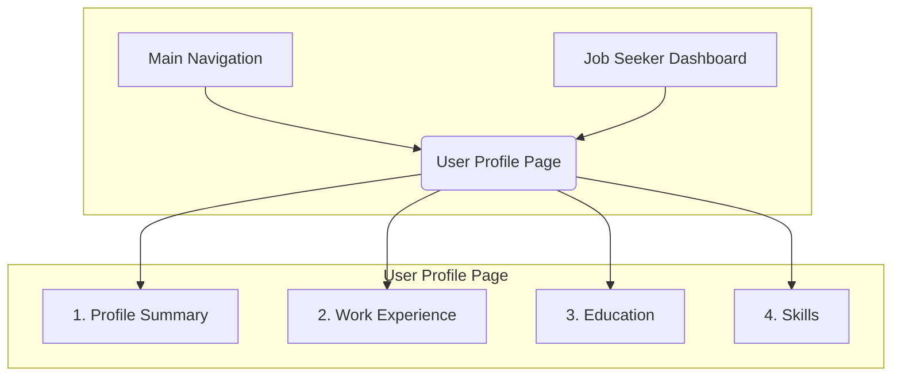

# Recruitify UI/UX Specification: User Profile Management

## 1. Introduction

This document defines the user experience goals, information architecture, user flows, and visual design specifications for the Recruitify platform's user interface, specifically for the User Profile Management feature. It serves as the foundation for visual design and frontend development, ensuring a cohesive and user-centered experience.

---

## 2. Overall UX Goals & Principles

### Target User Personas

*   **Job Seeker (Primary Persona):** This user is actively looking for a job. Their primary goal on the profile page is to create a comprehensive and compelling professional identity that accurately represents their skills and experience to potential employers. They value a simple, intuitive interface that makes it easy to add, edit, and manage their information.
*   **Recruiter (Secondary Persona):** This user is looking to hire qualified candidates. They will view the Job Seeker's profile to assess their suitability for a role. They need the information to be clearly organized, scannable, and easy to digest, allowing them to make quick, informed decisions.

### Usability Goals

*   **Efficiency of Use:** An existing user should be able to add a new work experience, education entry, or a set of skills to their profile in under 60 seconds.
*   **Ease of Learning:** A new user should be able to complete the core sections of their profile (Work Experience, Education, Skills) for the first time without needing to consult a help guide.
*   **Error Prevention & Recovery:** The interface will use clear inline validation (e.g., for date ranges) to prevent data entry errors. If an error occurs on save, the system will clearly highlight the field(s) that need correction without losing the user's other inputs.
*   **User Confidence:** Job seekers should feel confident that the information they enter is saved correctly and that the resulting profile view appears professional and well-structured to recruiters.

### Design Principles

1.  **Clarity and Simplicity:** The interface will prioritize clarity above all else. We will use clear, simple language for labels and instructions. The layout will be clean and uncluttered to prevent overwhelming the user.
2.  **Progressive Disclosure:** Instead of presenting one long, intimidating form, we will reveal input fields and sections contextually. For example, the form to add a new work experience will only appear after the user clicks an "Add Experience" button.
3.  **Direct Manipulation:** Users should be able to edit their information as close as possible to where it is displayed. We will favor in-place editing (e.g., clicking an "edit" icon on an item to make it editable) over navigating to separate pages for each change.
4.  **Provide Instant Feedback:** The system will provide immediate visual feedback for every action. When a user adds a skill or saves a section, the UI will update instantly and display a brief, non-intrusive success confirmation.

---

## 3. Information Architecture (IA)

### Site Map / Screen Inventory



### Navigation Structure

*   **Primary Navigation:** The main, site-wide navigation bar at the top of the page will contain a link to the user's profile. This will likely be within a dropdown menu accessed by clicking the user's name or avatar, with the menu item labeled "Profile" or "My Profile".
*   **Secondary Navigation (On-Page):** For longer profiles, we will include a "sticky" or "floating" on-page navigation component. This will allow the user to quickly jump between the "Work Experience," "Education," and "Skills" sections of their profile without extensive scrolling.
*   **Breadcrumb Strategy:** A breadcrumb trail will be displayed at the top of the profile page to provide context and an easy way back to parent pages. The typical path will be: `Home > Dashboard > Profile`.

---

## 4. User Flows

### Flow: Add New Work Experience

**User Goal:** To add a past or current job to the "Work Experience" section of their profile.
**Entry Points:** The user clicks an "Add New" or "+ Add Experience" button within the Work Experience section of their profile page.
**Success Criteria:** The newly added job is displayed in the list of work experiences, correctly formatted, and the entry form is closed.

**Flow Diagram**
```mermaid
graph TD
    A[Start: User on Profile Page] --> B[Clicks "+ Add Experience"];
    B --> C[An empty form for a new job appears];
    C --> D[User fills in job details];
    D --> E{Clicks "Save"};
    E --> F[Client-side validation runs];
    F -- Invalid --> G[Show inline error messages on specific fields];
    G --> D;
    F -- Valid --> H[Data is saved to the server];
    H --> I[The form closes];
    I --> J[The new job appears in the Work Experience list];
    J --> K[End: Success confirmation shown briefly];
```

### Flow: Edit Existing Work Experience

**User Goal:** To modify or update the details of a job already listed in their profile.
**Entry Points:** The user clicks an "Edit" icon or button that is directly associated with a specific job entry in the Work Experience list.
**Success Criteria:** The job entry is updated in the list with the new information, and the editing form is closed.

**Flow Diagram**
```mermaid
graph TD
    A[Start: User views a job in their profile] --> B[Clicks "Edit" icon on that job];
    B --> C[The view-only item transforms into an editable form, pre-filled with its data];
    C --> D[User changes the job details];
    D --> E{Clicks "Save"};
    E --> F[Client-side validation runs];
    F -- Invalid --> G[Show inline error messages];
    G --> D;
    F -- Valid --> H[Data is saved to the server];
    H --> I[The form reverts to a read-only view, showing the updated information];
    I --> J[End: Success confirmation shown briefly];
```

### Flow: Delete Existing Work Experience

**User Goal:** To permanently remove a job from their profile.
**Entry Points:** The user clicks a "Delete" (or trash icon) button that is directly associated with a specific job entry in the Work Experience list.
**Success Criteria:** The job entry is permanently removed from the Work Experience list.

**Flow Diagram**
```mermaid
graph TD
    A[Start: User views a job in their profile] --> B[Clicks "Delete" icon on that job];
    B --> C[A confirmation modal appears];
    C{{"Are you sure you want to delete this experience? This action cannot be undone."}} --> D[User clicks "Cancel"];
    C --> E[User clicks "Delete"];
    D --> F[End: Modal closes, no action is taken];
    E --> G[Item is deleted from the server];
    G --> H[The item is removed from the UI];
    H --> I[End: Success confirmation shown briefly];
```

---

## 5. Wireframes & Mockups

**Primary Design Files:**
High-fidelity mockups and prototypes will be created in an external design tool (e.g., Figma, Sketch, Adobe XD) and a link will be provided here for the development team.

### Key Screen Layout: User Profile Page

**Purpose:** To display the job seeker's complete professional profile in a clean, readable format, and to provide intuitive controls for editing the information.

**Key Elements (arranged vertically):**

1.  **Profile Header / Summary:**
    *   User's Avatar/Photo (left)
    *   User's Full Name (right of avatar)
    *   Current Job Title or Headline (below name)
    *   A brief "About Me" summary paragraph.
    *   An "Edit Summary" button/icon.

2.  **Work Experience Section:**
    *   Section Title: "Work Experience"
    *   A list of job entries, displayed chronologically (most recent first).
    *   Each entry will clearly show: Job Title, Company, Dates, and Description.
    *   Each entry will have an "Edit" and "Delete" icon on hover or focus.
    *   A prominent `[+ Add Experience]` button will be at the end of the list.

3.  **Education Section:**
    *   Section Title: "Education"
    *   A list of educational institutions, similar in layout to the Work Experience section.
    *   Each entry will have "Edit" and "Delete" icons.
    *   A `[+ Add Education]` button will be at the end of the list.

4.  **Skills Section:**
    *   Section Title: "Skills"
    *   A collection of tags, each displaying a skill.
    *   Each tag will have a small "x" icon to remove it.
    *   An input field or button `[+ Add Skill]` to add new skills.

---

## 6. Component Library / Design System

**Design System Approach:**
We will use the existing **Ant Design** component library as the foundation for our UI. This ensures a consistent, professional look and feel and accelerates development. We will customize Ant Design components where necessary and create new components only when a suitable one is not available.

### Core Components

1.  **Card:**
    *   **Purpose:** To act as a container for major sections like "Work Experience" and "Education," providing visual separation and structure.
2.  **ListItem:**
    *   **Purpose:** To display a single entry within a list (e.g., one job in the Work Experience section). It will contain the text content and the "Edit" / "Delete" icons.
3.  **Button:**
    *   **Purpose:** For all primary actions, such as `[+ Add Experience]` and "Save". We will use different styles (e.g., primary, default, danger) for different actions.
4.  **Tag:**
    *   **Purpose:** To display individual skills in the Skills section. Each tag will have a "closable" state to allow for removal.
5.  **Modal:**
    *   **Purpose:** To display the confirmation message before a user deletes an item, preventing accidental data loss.
6.  **Input & TextArea:**
    *   **Purpose:** Standard form elements for entering single-line (e.g., Job Title) and multi-line (e.g., Job Description) text.
7.  **Avatar:**
    *   **Purpose:** To display the user's profile picture in the header.

---

## 7. Branding & Style Guide

**Visual Identity:**
The initial visual identity will be clean, minimalist, and professional, leveraging the default styles of the Ant Design system. The focus is on readability and usability.

### Color Palette

| Color Type | Hex Code | Usage |
| :--- | :--- | :--- |
| Primary | `#1677ff` | Key actions, links, highlights (Ant Design Blue) |
| Success | `#52c41a` | Success messages, validation (Ant Design Green) |
| Warning | `#faad14` | Mild warnings, non-critical alerts (Ant Design Gold) |
| Error | `#f5222d` | Error messages, destructive actions (Ant Design Red) |
| Neutral | `#000000` - `#ffffff` | A scale of grays for text, backgrounds, and borders |

### Typography

*   **Font Family:** We will use the system's default UI font (e.g., San Francisco on macOS, Segoe UI on Windows). This ensures optimal readability and performance without requiring custom font loading. The declaration would be: `-apple-system, BlinkMacSystemFont, 'Segoe UI', Roboto, 'Helvetica Neue', Arial, 'Noto Sans', sans-serif`.
*   **Type Scale:**
| Element | Size | Weight |
| :--- | :--- | :--- |
| H1 | 38px | 600 (Semibold) |
| H2 | 30px | 600 (Semibold) |
| H3 (Section Titles) | 24px | 600 (Semibold) |
| Body (Default Text) | 16px | 400 (Regular) |
| Small (Labels, captions) | 14px | 400 (Regular) |

---

## 8. Accessibility Requirements

**Compliance Target:**
**Standard:** WCAG 2.1, Level AA

### Key Requirements

*   **Visual:**
    *   **Color Contrast:** All text, including text within buttons, must have a minimum contrast ratio of 4.5:1 against its background.
    *   **Focus Indicators:** Every interactive element (links, buttons, form fields) must have a highly visible and distinct focus indicator when navigated to via a keyboard.
*   **Interaction:**
    *   **Keyboard Navigation:** All functionality, including adding, editing, and deleting profile items, must be fully operable using only a keyboard. The tab order through the page must be logical and predictable.
    *   **Screen Reader Support:** All form inputs must have associated labels. All icons used for actions (like "Edit" or "Delete") must have accessible names (e.g., `aria-label="Edit work experience"`) so their purpose is clear to screen reader users.
*   **Content:**
    *   **Heading Structure:** The page will use a logical heading structure (H1, H2, H3) to define the sections, allowing users to easily navigate the page's structure.
    *   **Alternative Text:** The user's profile image will have appropriate alternative text (e.g., "Profile picture of [User's Name]").

---

## 9. Responsiveness Strategy

### Breakpoints

| Breakpoint | Min Width | Target Devices |
| :--- | :--- | :--- |
| Mobile | (up to 767px) | Smartphones |
| Tablet | 768px | Tablets |
| Desktop | 1024px | Laptops, Desktops |

### Adaptation Patterns

*   **Layout:**
    *   **Desktop:** The layout will be as we described in the wireframe, with a comfortable width and clear separation between sections.
    *   **Tablet:** The layout will remain similar to desktop, but with reduced margins and padding to make better use of the space.
    *   **Mobile:** The layout will collapse into a single, vertical column. The profile header (avatar and name) will stack vertically. All sections will flow one after the other.
*   **Navigation:**
    *   The main site navigation will collapse into a "hamburger" menu on mobile and tablet devices.
    *   The on-page secondary navigation (for jumping between profile sections) may transform from a sticky bar on desktop to a dropdown menu on mobile to conserve screen real estate.
*   **Interaction:**
    *   Touch targets for all interactive elements (buttons, icons, links) will be a minimum of 44x44 pixels on mobile and tablet to ensure they are easy to tap.
    *   Hover-based interactions (like showing icons on hover) will be replaced with tap-based interactions on touch devices.

---

## 10. Next Steps

### Immediate Actions

1.  **Review with Stakeholders:** This document should be reviewed by key stakeholders (e.g., Product Manager, Lead Engineer) to ensure alignment.
2.  **Begin Visual Design:** A visual designer can now use this specification to create high-fidelity mockups in a tool like Figma.
3.  **Handoff to Architecture:** This document is ready to be handed off to the Architect, who can use it to design the detailed front-end technical architecture.

### Design Handoff Checklist

- [x] All user flows documented
- [x] Component inventory complete
- [x] Accessibility requirements defined
- [x] Responsive strategy clear
- [x] Brand guidelines incorporated
- [x] Performance goals established
